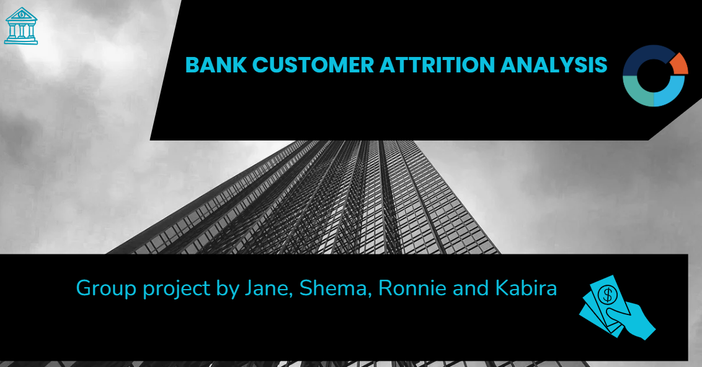
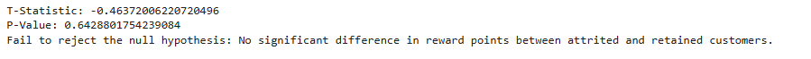
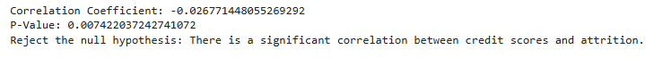
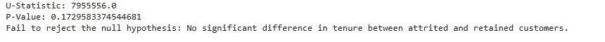
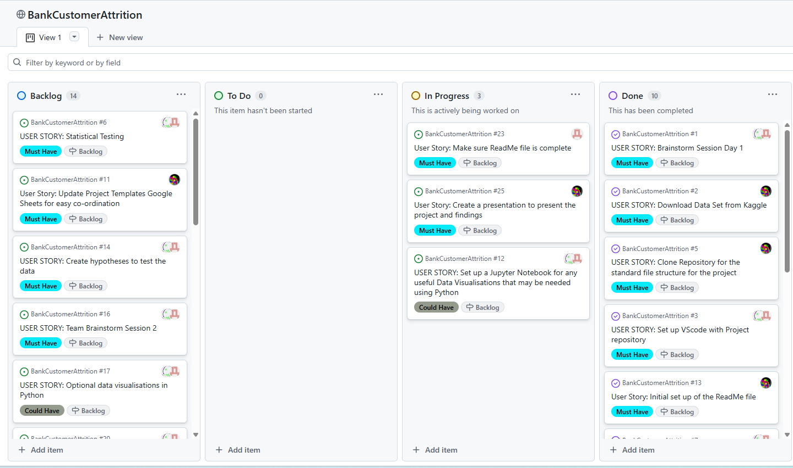
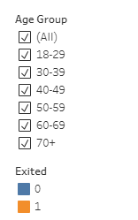
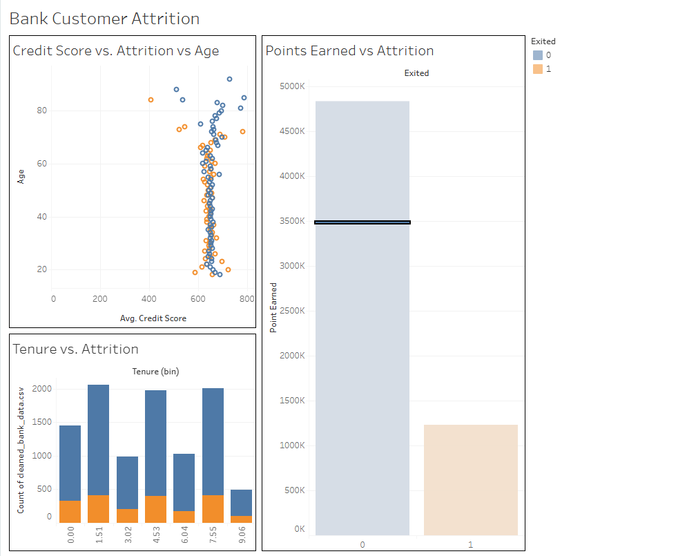

# Bank Customer Attrition Analysis

**Bank Customer Attrition Analysis** is a group project with the aim of identifying reasons why bank customers leave. Our aim to help banks increase their customer retention rates by exploring the reasons and factors that result in customer loss. 

# 

## Navigation:
* [ 01: ETL Pipeline](https://github.com/rmj9000/BankCustomerAttrition/blob/main/jupyter_notebooks/01_etl.ipynb)
* [02: Exploratory Data Analysis](https://github.com/rmj9000/BankCustomerAttrition/blob/main/jupyter_notebooks/02_eda.ipynb)
* [03: Heat Map](https://github.com/rmj9000/BankCustomerAttrition/blob/main/jupyter_notebooks/03_heatmap.ipynb)
* [04: Hypothesis Testing](https://github.com/rmj9000/BankCustomerAttrition/blob/main/jupyter_notebooks/04_hypothesis-testing.ipynb)
* [05: Data Transformation for Tableau](https://github.com/rmj9000/BankCustomerAttrition/blob/main/jupyter_notebooks/05_tableau-data.ipynb)
* [06: Tableau Dashboard](https://public.tableau.com/shared/GMW47YQH9?:display_count=n&:origin=viz_share_link)
* [07: Raw Data](https://github.com/rmj9000/BankCustomerAttrition/blob/main/data/inputs/raw/bank_customer_attrition_insights_data.csv)
* [08: Cleaned Data](https://github.com/rmj9000/BankCustomerAttrition/blob/main/data/inputs/cleaned_bank_data.csv)

## Dataset Content
* The data is sourced from [Kaggle](https://www.kaggle.com/datasets/marusagar/bank-customer-attrition-insights) and contains many routes of inquiry for why customers at banks attrite. 

## Contributers

* Project Manager - [Ronnie](https://github.com/rmj9000) 
* Data Architect - [Kabira Sharpe](https://github.com/ksharpe-byte)
* Data Analyst - [Jane Weightman](https://github.com/Janeweightman)
* Data Analyst - [Shema Rahman](https://github.com/Shema774)

## Business Requirements
According to the finance publication [The Financial Brand](https://thefinancialbrand.com/news/bank-onboarding/the-churn-challenge-four-big-ideas-for-banks-and-credit-unions-looking-to-drive-down-attrition-182528) banks struggle with a 15% attrition rate. Losing customers results in financial damage, and banks should seek to retain as large of a share of customers as they can. Analysing the trends in customer attrition can allow banks to make data informed decisions on building new strategies to increase their customer retention. 

## Hypotheses
### Hypothesis 1: Customers who earn fewer reward points are more likely to attrite.
Reward points often reflect transaction activity and customer engagement. If customers earning fewer points are more likely to leave, it suggests that low engagement is a key driver of attrition. This insight could help the bank identify disengaged customers early and design targeted retention strategies.

#### How we plan to validate:

*Points Earned vs. Attrition*
* T-test: Compares the means of two groups (e.g., attrited vs. existing customers). Assumes normal distribution.

### Hypothesis 2: Credit card customers with lower credit scores are more likely to attrite.
Lower credit scores may indicate financial instability or limited access to banking services. These customers might leave voluntarily due to dissatisfaction or be targeted for closure by the bank. Understanding this relationship can guide credit policy and customer support strategies.

#### How we plan to validate:

*Credit Score vs. Attrition*
* Correlation analysis: Measures the strength and direction of association between two variables (e.g., credit score and attrition flag).
* Logistic regression on a Scatter Plot: A predictive statistical model that estimates the probability of a binary outcome (e.g., attrition) based on one or more predictors (e.g., credit score).

### Hypothesis 3: Customers with shorter tenure at the bank are more likely to attrite.
We suspect that some customers will hop from bank to bank to take adantage of signup bonuses. Furthermore, if newer customers are more prone to leaving, it may signal issues with onboarding, early experience, or unmet expectations. This insight is crucial for improving customer retention strategies during the first few months of engagement

#### How we plan to validate:

*Tenure vs. Attrition*
* T-test / Mann-Whitney U test: Again, used to compare tenure between groups.
* Boxplot: While visualisations themselves aren’t statistical tests, they support statistical interpretation by showing distribution patterns.

## Hypothesis Testing
### H1: Customers who earn fewer reward points are more likely to attrite
**For the first hypothesis we used a T test.**

 

 With a T-Statistic of -0.46 and P-Value of 0.64 we fail to reject the null hypothesis, therefore we must conclude that fewer customer reward points does not result in higher rates of attrition. 
 ### H2: Credit card customers with lower credit scores are more likely to attrite
 **For the second hypothesis we used a Pearsons Correlation.**

 

 The correlation coefficent is -0.0268 which indicates there is a weak negative correlation between Credit Score and Exited variables. With a P-Value of 0.007 which indicates the result is statistically significant. We must reject the null hypothesis and accept that credit score is a factor in attrition rate. 

 ### H3: Customers with shorter tenure at the bank are more likely to attrite
 **For Hypothesis 3 we used a Mann-Whitney U Test.**
 

 The U-Statistic is 7955556.0, which suggests the two groups overlap significantly meaning there is little difference between them. The P-Value is 0.1729 which greater than the significance level. Indidcating the observed difference between Tenure and Attrition is not statistically significant. Thus we fail to reject the null hypothesis as there is no statistical significance.

## Project Plan
**To aid in planning we used a [Github project board](https://github.com/users/rmj9000/projects/8/views/1)**

* Using a project board allowed us to assign tasks to each team member in an organised manner
* Regular meetings on Google Meets were used to ensure effective and regular communication, brainstorming sessions and completing tasks as a team.

## Ethical considerations
* Financial data is highly sensitive and those working with such data have to ensure they are compliant with laws such as the [Financial Services and Markets Act 2000](https://www.legislation.gov.uk/ukpga/2000/8/contents).
* To ensure data privacy we removed the 'Surnames' column of the dataset, as it contains personally identifiable information. 

## Dashboard Design
**The Dashboard can be found [here](https://public.tableau.com/app/profile/shema.rahman/viz/shared/GMW47YQH9)**.

Storyboard format was used for effective interactive story telling. 

Filters were used to enhance user interactivity. 

Images were collated at the final story tab for ease of comparison. 

## Development Roadmap
* We had issues with data types in Tableau for the exited variable, we had to change the data type to string manually in Tableau as it was incorrectly categoried as an integer. 

## Main Data Analysis Libraries
* **Numpy**: For all Jupyter notebooks
* **Pandas**: For all Jupyter notebooks
* **Matplotlib**: For visualisations
* **Seaborn**: For visualisations
* **Scipy**: For hypothesis testing

## Credits 

* [Copilot](https://copilot.microsoft.com/chats/29Q4jJBsA7BkBDH9Kqkve) for Tableau csv files
* [Chat-GPT](https://chatgpt.com/) for help with Tableau Dashboard
* [Copilot](https://copilot.microsoft.com/chats/29Q4jJBsA7BkBDH9Kqkve) for coding assistance & generating a summary for the hypothesis testing visualisations
* [Code Institute LMS modules](https://learn.codeinstitute.net/ci_program/daai_9)
* [Markdown Guide](https://www.markdownguide.org/)

### Media

- Banner image was made using [Canva](https://www.canva.com/) 

## Acknowledgements
* A special thanks to all the tutors at Code Insitute and to all our class mates! We wish everyone the best following our final Code Institute project. 
